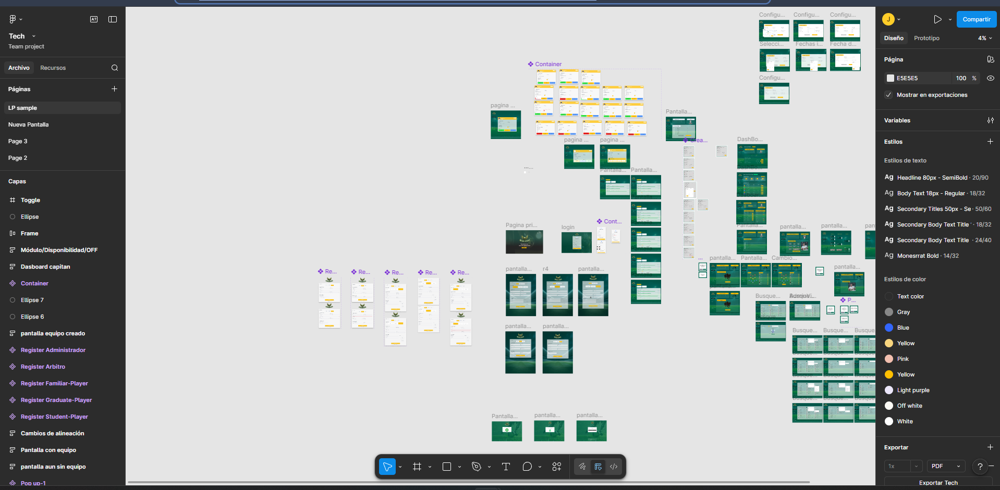
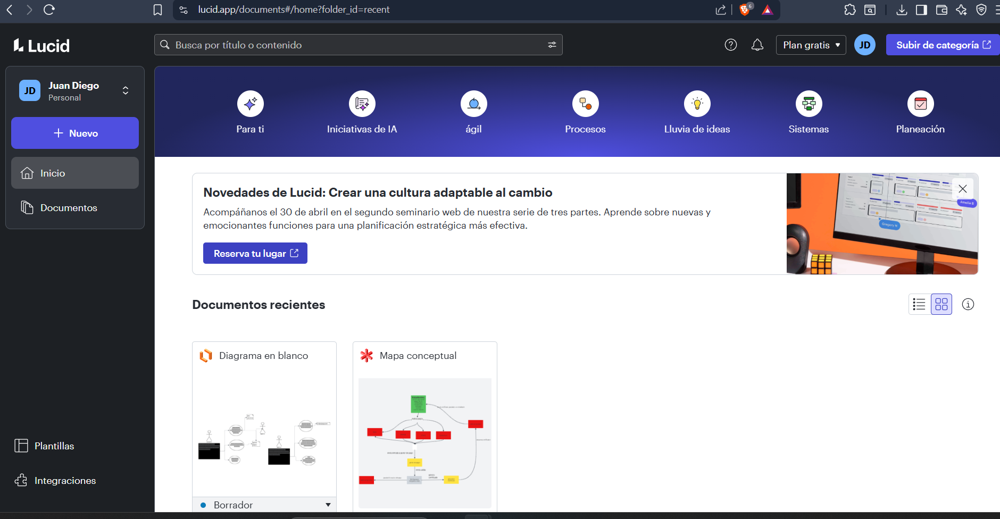

# DOSW_ParcialT2_JuanMelo

**Nombre:** Juan Diego Melo Suarez  
**Grupo:** #2

## Herramientas de Modelado y Diseño

### Figma

### Lucidchart

## Tecnologías
- Java 21
- Spring Boot 3.3
- Spring Security + JWT
- JPA + H2
- Swagger
- Lombok + MapStruct
- JUnit + Mockito
- Jacoco
- SonarQube